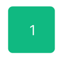
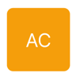

# Buttonコンポーネントを作成する

## イメージ

[Figmaデザイン](https://www.figma.com/file/XhtMnTFMMn5Vc3lG437iWA/Calcurator?type=design&node-id=2902-174&mode=design&t=iWYoiusQVYKnkFeT-4)

## ボタンの例

### 1のボタン

背景が緑色で正方形。少し角丸なデザイン。

### 0のボタン

背景が緑色で長方形。少し角丸なデザイン。

### ACのボタン

背景がオレンジで正方形。少し角丸なデザイン。

## 受け入れ条件

- 1 ~ 9のボタン（緑色背景の正方形）
- 0のボタン（緑色背景の長方形）
- AC、+、-、=のボタン（オレンジ背景の正方形）

これらのボタンコンポーネントを作成できている。

## 進め方ヒント

- 可能であればこれを１つのコンポーネントで作成できるようにしたい
  - 背景色やサイズ、中の文字を動的に変更できるような設計が好ましい

## 注意

- ボタンを押下した際の挙動は実装しなくてOK