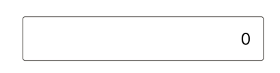
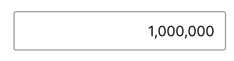

# Displayコンポーネントを作成する

## イメージ

[Figmaデザイン](https://www.figma.com/file/XhtMnTFMMn5Vc3lG437iWA/Calcurator?type=design&node-id=2902-174&mode=design&t=iWYoiusQVYKnkFeT-4)

- 枠線あり
- 角丸

- 3桁ごとにカンマ（`,`）を表示 

あくまでもデザイン例

## 受け入れ条件

以下の条件を満たすDisplayコンポーネントを作成できている。

- propsで数値を受け取って、受け取った数値が3桁ごとにカンマ区切りで表示される
