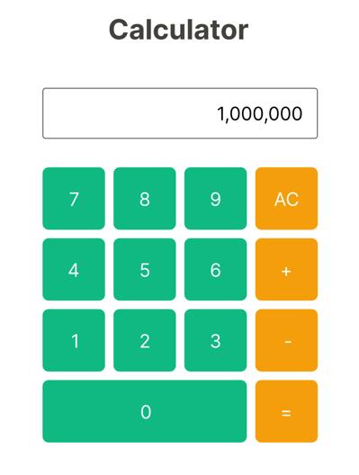

# 今までに作成したコンポーネントを組み立てる

## イメージ

[Figmaデザイン](https://www.figma.com/file/XhtMnTFMMn5Vc3lG437iWA/Calcurator?type=design&node-id=2902-174&mode=design&t=iWYoiusQVYKnkFeT-4)

## 受け入れ条件

- Title、Display、Buttonコンポーネントを組み合わせて電卓のUIを仕上げる

## 注意

- まだ計算のロジックは実装しなくてOK