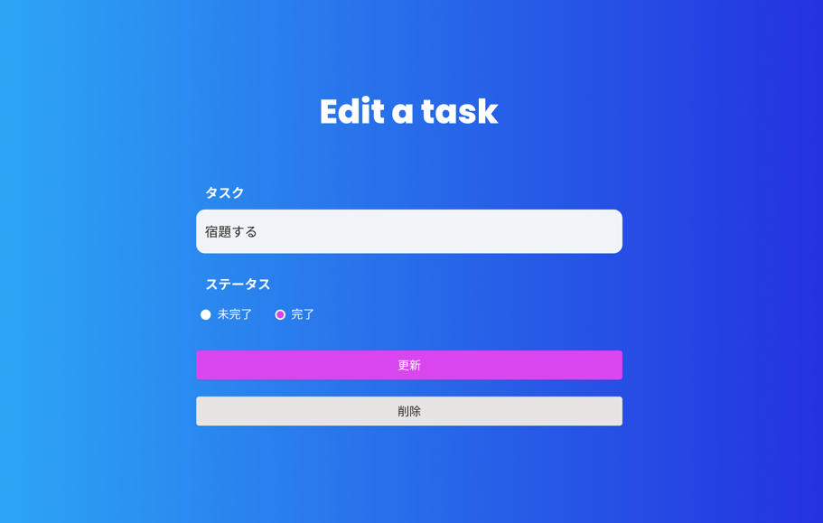

# タスク編集ページが作成できている

タスク編集ページでは以下の機能を提供します。

- タスク情報を変更できる
- ステータス（完了 or 未完了）を変更できる
- 変更ボタンを押下すると、タスク情報の変更が完了し、トップページにリダイレクトする
- 削除ボタンを押下すると、タスク情報が削除され、トップページにリダイレクトする

## イメージ

## 受け入れ条件

- タスク新規作成ページで必要な機能が実装できている
