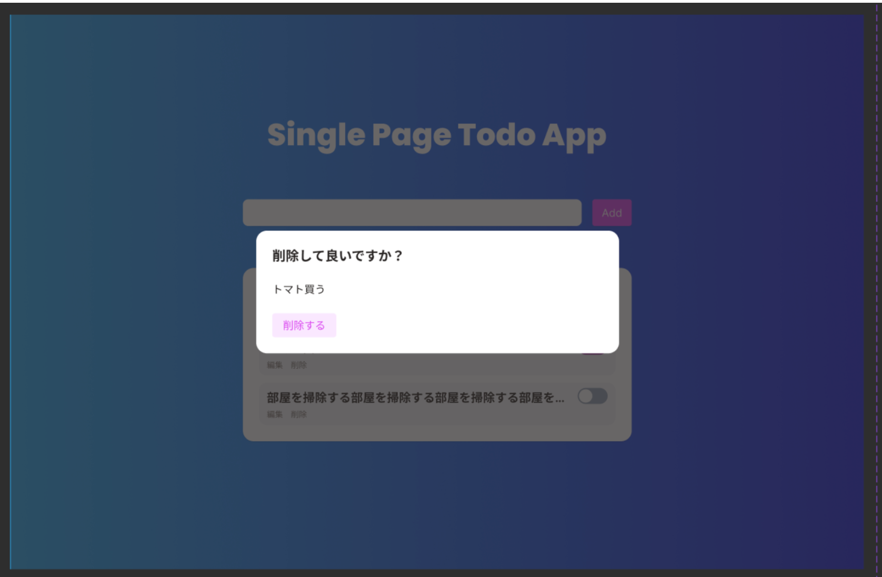

# DeleteModalコンポーネントを実装する

## イメージ

https://www.figma.com/file/qsxn8ppZsyBSVU5BFAumbk/SinglePageTodoApp?type=design&node-id=706-236&mode=design&t=AqtYtmbG6U99c0t2-4

## 要件

- 表示/非表示の状態をもつ
- アクションボタンがあり、押下すると任意の関数を実行できる
- 白枠以外をクリックするとモーダルが閉じる

## 必要条件

- UIの実装
- スナップショットテストの実装
- Storybook実装

## 実装メモ

[Headless UI](https://headlessui.com/react/dialog) を参考に実装お願いしますm