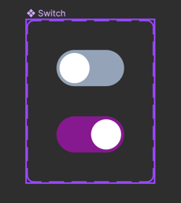

# Switchコンポーネントを実装する

## デザイン

https://www.figma.com/file/qsxn8ppZsyBSVU5BFAumbk/SinglePageTodoApp?type=design&node-id=704-17&mode=design&t=AqtYtmbG6U99c0t2-4

## 要件

- on/offのステータスがある
- ステータスが変更された場合に任意の関数を実行できる

## 必要条件

- UIの実装
- スナップショットテストの実装
- Storybook実装

## 実装のヒント

Headless UIを用いて実装してみましょう。

- https://headlessui.com/react/switch

このページのサンプルコードを使うとUIの形はそれっぽくなります。