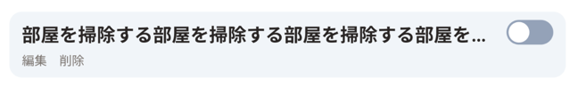

# TodoItemコンポーネントを実装する

## イメージ

https://www.figma.com/file/qsxn8ppZsyBSVU5BFAumbk/SinglePageTodoApp?type=design&node-id=706-54&mode=design&t=AqtYtmbG6U99c0t2-4

上から

- デフォルト状態
- 完了状態
- 編集状態

## 要件

- Switchがoffだと未完了状態、onだと完了状態である
- Switchをonにすると完了状態、offにすると未完了状態に変更する処理が走る
- 編集ボタンを押下すると編集状態になり、タスクが編集できる
    - 編集状態では、編集ボタンは保存ボタンに変わる
    - 編集状態に変化すると、入力フォームに自動的にフォーカスがあたる
    - 編集状態中はSwitchと削除ボタンは押下できない
- 保存ボタンを押下するとデフォルト状態に戻る
- 削除ボタンを押下するとモーダルが表示される
- モーダル内の削除ボタンを押下すると削除処理が走る
- タスク名が長い場合は「...」を表示する

## 必要条件

- UIの実装
- スナップショットテストの実装
- Storybook実装
- 更新処理、削除処理は実際にAPIの通信処理をしなくても良い。モック化するか、ローカル環境にて永続化処理を行う（localStorageを使うなど）
