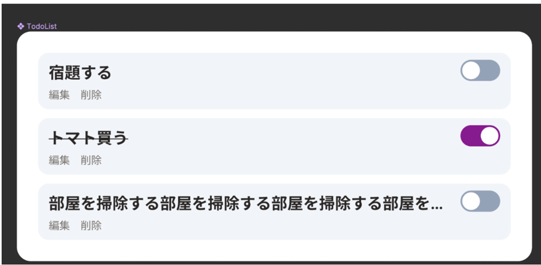

# TodoListコンポーネントを実装する

## イメージ

TodoItemコンポーネントを複数表示する

## 要件

- TodoItemのリストを表示する
- TodoItemがない場合は「Task Empty :(」を表示する
- タスク情報を取得中の場合は「Loading...」を表示する
- タスク情報の取得に失敗した場合は「Error :(」を表示する

## 必要条件

- UIの実装
- スナップショットテストの実装（オプション）
- Storybook実装（オプション）
